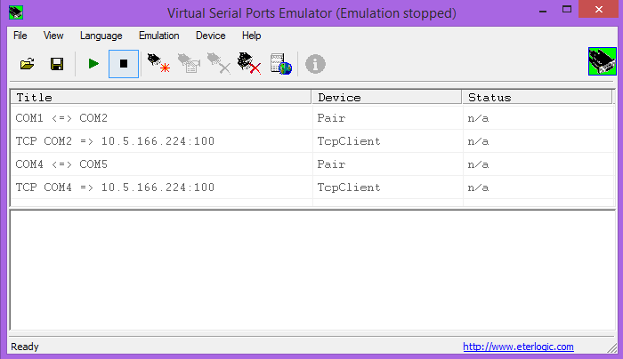

# VirtualCom-Linux
this script is helping to create a virtual COM port on linux and allow you to share serial data throught TCP/IP
if you are familiar with VSPE in Windows that sould be easy.

there is anouther way to see serial data by the tool Screen 

-----------------------------------------

you can run this script by typing (in root):

# # ./COM_Server.sh <Port_number> <Number_COM>

it will creat a virtual COM port /dev/ttyS<Number_COM> 
you can change the permisson with chmod to allow user application to access to it 

--! you should have insttaled the nmap package !--

azilhamza@gmail.com
